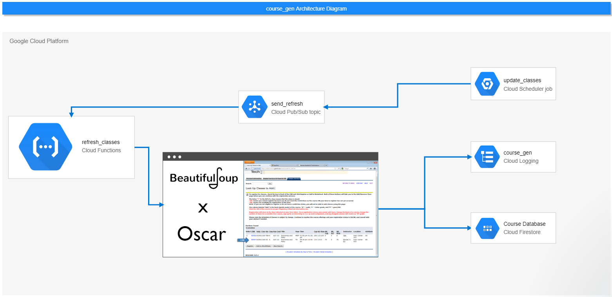

.                     |.
:--------------------:|:--------------------:
  |

# course_gen

Batch process to regularly scrape course data from [Oscar](https://oscar.gatech.edu) which is persisted to Cloud MySQL database.

## Architecture Diagram

## Setup

For local development, you will need to:

1. Set up project virtual environment (Python 3.7 interpreter)

2. `pip install -r requirements.txt`

3. Install [Cloud SQL Proxy Client](https://cloud.google.com/sql/docs/mysql/quickstart-proxy-test) and start proxy

4. Setup [GOOGLE_AUTHENTICATION_CREDENTIALS](https://cloud.google.com/docs/authentication/getting-started)

5. Acquire and set all IDE environment variables required to run locally (accessed by `os.environ.get` in `main.py`)

6. Run `main.py`
